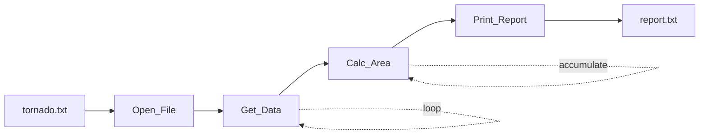
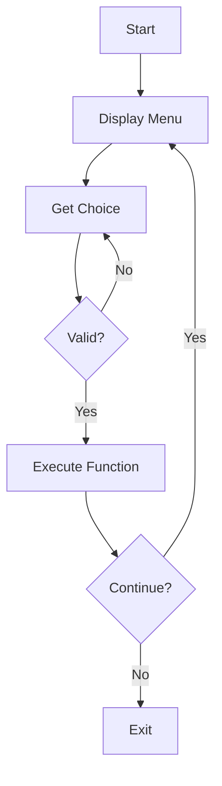
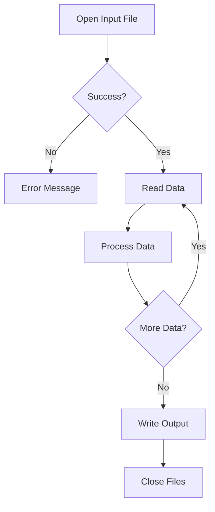

# Architecture Overview

This document describes the organization, structure, and learning progression of the CSC-150 repository.

## Repository Organization

The repository is organized into three main categories:

1. **Major Programs (P1-P7)** - Comprehensive projects covering course objectives
2. **Chapter Exercises** - Targeted exercises for specific concepts
3. **Practice Scripts** - Experimental and learning-focused code

### Directory Structure

```
CSC-150-with-C/
│
├── P1 C/                                    # Program 1
├── P2-150 - Fill time for cylindrical Water Tank/
├── P3-150 - Hobo Day Mug/
├── P4-150 - Diceroll Game/
├── P5-150 - Patterns Menu program/
├── P6-150 - Tornado Area/
├── P7-150 - Snowblower sales/
│
├── Chapter Exercises/
│   ├── Chapter 1 Exercises/
│   ├── Chapter 2 Exercises/
│   ├── Chapter 3 Problems/
│   ├── Chapter 4 Exercises/
│   ├── Chapter 5 Exercises/
│   ├── Chapter 6 Exercises/
│   └── Chapter 7 Exercises/
│
├── Practice and small scripts/
│   ├── Array practice/
│   ├── Menu Driven Coffee program/
│   ├── Practice with reading files/
│   └── [15+ other practice programs]
│
├── Precipitation Practice/
├── TOu Hospital Intraveinous Assistant/
│
├── .vscode/                                 # IDE configuration
│   ├── tasks.json                          # Build tasks
│   ├── launch.json                         # Debug configuration
│   └── settings.json                       # Editor settings
│
├── docs/                                    # Documentation
│   ├── ARCHITECTURE.md                     # This file
│   └── DEVELOPMENT.md                      # Development guide
│
├── .gitignore                              # Git ignore rules
├── LICENSE                                 # GPL-3.0 license
└── README.md                               # Main documentation
```

## Learning Progression

### Foundational Concepts (Chapters 1-3)

**Topics Covered:**
- Basic I/O with `printf()` and `scanf()`
- Variables and data types (`int`, `float`, `char`)
- Arithmetic operators and expressions
- Constants and `#define` directives

**Representative Programs:**
- **[Rectangle Area](../Chapter%20Exercises/Chapter%202%20Exercises/9a%20Area%20of%20Rectangle/)** - Basic calculations
- **[P2 Water Tank](../P2-150%20-%20Fill%20time%20for%20cylindrical%20Water%20Tank/)** - Mathematical formulas and constants

### Control Structures (Chapters 4-5)

**Topics Covered:**
- Conditional statements (`if`, `else`, `switch`)
- Boolean logic and comparison operators
- Loops (`for`, `while`, `do-while`)
- Loop control (`break`, `continue`)

**Representative Programs:**
- **[Chapter 4: Educational Level](../Chapter%20Exercises/Chapter%204%20Exercises/Q3%20Educational%20Level/)** - Switch statements
- **[Chapter 4: Age Check](../Chapter%20Exercises/Chapter%204%20Exercises/Q6%20Age%20check/)** - Conditional logic
- **[Chapter 5: Temperature Sum](../Chapter%20Exercises/Chapter%205%20Exercises/Q1%20Temperature%20sum%20with%20sentinel/)** - Sentinel loops
- **[P4 Dice Game](../P4-150%20-%20Diceroll%20Game/)** - Complex conditional logic
- **[P5 Patterns](../P5-150%20-%20Patterns%20Menu%20program/)** - Nested loops

### Functions and Modular Design (Chapter 6)

**Topics Covered:**
- Function prototypes and definitions
- Parameter passing (by value)
- Return values
- Scope and lifetime of variables
- Code reusability and organization

**Representative Programs:**
- **[P3 Hobo Mug](../P3-150%20-%20Hobo%20Day%20Mug/)** - Multiple functions with calculations
- **[Chapter 6: Letter Grade](../Chapter%20Exercises/Chapter%206%20Exercises/Q1%20Letter_grade%20function/)** - Function design
- **[P6 Tornado](../P6-150%20-%20Tornado%20Area/)** - Modular architecture

### Advanced Data Structures (Chapter 7)

**Topics Covered:**
- One-dimensional arrays
- Array initialization and traversal
- Searching and sorting algorithms
- Statistical analysis with arrays

**Representative Programs:**
- **[Chapter 7: Bubble and Selection Sort](../Chapter%20Exercises/Chapter%207%20Exercises/Q%2010%20Bubble%20and%20selection%20sort/)** - Sorting algorithms
- **[P7 Snowblower Sales](../P7-150%20-%20Snowblower%20sales/)** - Complete array-based analysis

### File I/O and Data Processing

**Topics Covered:**
- File operations (`fopen()`, `fclose()`)
- Reading from files (`fscanf()`, `fgets()`)
- Writing to files (`fprintf()`)
- Error handling for file operations
- Data processing and report generation

**Representative Programs:**
- **[P6 Tornado Area](../P6-150%20-%20Tornado%20Area/)** - Read tornado data, calculate areas, generate report
- **[P7 Snowblower Sales](../P7-150%20-%20Snowblower%20sales/)** - Read sales data, perform analysis
- **[Precipitation Practice](../Precipitation%20Practice/)** - Weather data analysis

## Module Descriptions

### Major Programs

Each major program follows a consistent structure:

```
Program N/
├── Requirements & Design/          # Design documentation
│   ├── *.doc, *.docx              # Requirements and specifications
│   ├── *.png                      # Flowcharts and structure charts
│   └── *.xmind                    # Mind maps (source files)
├── Program N code/                # Primary implementation
│   └── *.c                        # Source code
└── Version N/                     # Alternative implementations
    └── *.c                        # Version iterations
```

#### P2: Water Tank Fill Time Calculator
**Complexity:** Low  
**Concepts:** Variables, constants, arithmetic, type conversion  
**Input:** Tank dimensions (diameter, height)  
**Output:** Fill time in hours and minutes  
**Key Functions:** None - single main function

#### P3: Hobo Day Mug Volume
**Complexity:** Medium  
**Concepts:** Functions, modular design, math library  
**Input:** Mug diameter  
**Output:** Volume in cubic inches, ounces, and liters  
**Key Functions:**
- `printWelcome()` - User greeting
- `getDiameter()` - Input collection
- `calcRadius()` - Geometry calculation
- `calcVolume_inch()` - Hemisphere volume
- `convertToOunces()`, `convertToLitres()` - Unit conversion
- `printResults()` - Formatted output

#### P4: Dice Roll Game
**Complexity:** Medium-High  
**Concepts:** Random numbers, game logic, control flow  
**Input:** User prompts to roll dice  
**Output:** Game results and winner determination  
**Key Functions:**
- `WelcomeStatement()` - Game rules
- `DiceRoll()` - Random number generation (1-6)
- `UserX()`, `CompX()` - Sum calculations
- `DetermineWinner()` - Game logic (Snake Eyes, Lucky 7, Closest to 12)

**Special Features:**
- Time-based random seeding with `srand(time(NULL))`
- Bug fixes documented in code comments

#### P5: Patterns Menu Program
**Complexity:** Medium-High  
**Concepts:** Nested loops, menu systems, enumerations  
**Input:** Pattern choice (1-4) and size  
**Output:** ASCII art patterns  
**Key Functions:**
- `Welcome()` - Program introduction
- `Main_Menu()` - Display options
- `Get_Choice()` - Input validation using `enum`
- `Get_Size()` - Size validation
- `Pick_Pattern()` - Switch statement router
- `Pattern_1()` through `Pattern_4()` - Pattern generation algorithms

**Pattern Types:**
1. Right-aligned triangle
2. Left-aligned triangle
3. Diamond shape
4. Diagonal pattern

#### P6: Tornado Area Analysis
**Complexity:** High  
**Concepts:** File I/O, data processing, error handling, modular design  
**Input:** `tornado.txt` file with Fujita scale, path length, path width  
**Output:** `report.txt` with tabular data and total affected area  
**Key Functions:**
- `Welcome()` - Program description
- `Open_File()` - File opening with error checking (returns 404 on failure)
- `Get_Data()` - Read one line of tornado data
- `Calc_Area()` - Calculate affected area and running total
- `Print_Report()` - Generate formatted output

**Data Flow:**


#### P7: Snowblower Sales Analytics
**Complexity:** High  
**Concepts:** Arrays, sorting, statistics, file I/O  
**Input:** `throwers.txt` file with 6 monthly sales figures (Oct-Mar)  
**Output:** Comprehensive statistical analysis and histogram  
**Key Functions:**
- `Read_Data()` - Load sales data into array
- `Find_Most()` - Identify month with highest sales
- `Find_Least()` - Identify month with lowest sales
- `Calc_Total_Average()` - Compute sum and mean
- `Sort()` - Bubble or selection sort implementation
- `Find_Median()` - Calculate median from sorted array
- `Find_Mode()` - Mode calculation using frequency array
- `Print_Month_Name()` - Convert month number to name (Oct=1, Mar=6)
- `Print_Histogram()` - ASCII histogram visualization

**Statistical Measures:**
- Total sales
- Mean (average)
- Median (middle value)
- Mode (most frequent value)
- Min/Max identification

**Known Issues:**
- Bug#1 (Fixed): Segmentation fault - compiler incompatibility, resolved by using gcc instead of g++
- Bug#2 (Documented): Histogram infinite loop - commented out in code

#### TOu Hospital Intravenous Assistant
**Complexity:** Medium-High  
**Concepts:** Menu-driven interface, domain-specific calculations  
**Input:** Medical parameters (rates, volumes, concentrations)  
**Output:** Calculated IV rates in appropriate units  

**Calculation Types:**
1. `ml/hr` & tubing drop factor → `drops/min`
2. `1L for n hours` → `ml/hr`
3. `mg/kg/hr` & concentration → `ml/hr`
4. `units/hr` & concentration → `ml/hr`

### Chapter Exercises

Exercises are standalone programs focusing on specific concepts:

**Chapter 2 (5 exercises):**
- Basic I/O and arithmetic
- Variable declarations
- Simple algorithms

**Chapter 4 (6 exercises):**
- Conditional statements
- Switch statements
- Nested conditionals
- Educational level classification
- Inventory value calculation
- Age validation

**Chapter 5 (7 exercises):**
- Loop structures
- Sentinel values
- Code tracing
- Input validation with loops

**Chapter 6 (Functions):**
- Letter grade function
- Parameter passing
- Return values

**Chapter 7 (Sorting):**
- Bubble sort implementation
- Selection sort implementation
- Array manipulation

### Practice Scripts

Located in `Practice and small scripts/`, these programs demonstrate:

- **Array Practice** - Array initialization, traversal, manipulation
- **Array Search and Sort** - Linear search, binary search
- **Menu Programs** - Coffee ordering system with calculations
- **File Reading** - Text file processing examples
- **Loop Experiments** - Various loop patterns and techniques
- **Mathematical Functions** - Square root, circle calculations
- **Continue Statement** - Loop control demonstrations

## Common Patterns

### Program Structure

Most programs follow this pattern:

```c
// Header comments
// Author, date, course information

// Preprocessor directives
#include <stdio.h>
#include <stdlib.h>  // If using rand() or dynamic allocation
#include <math.h>    // If using mathematical functions
#include <time.h>    // If using time-based seeding

// Constants
#define CONSTANT_NAME value
const float PI = 3.14159;

// Function prototypes
void FunctionName(int param);

// Main function
int main(void) {
    // Variable declarations
    // Function calls
    // Processing
    // Output
    return 0;
}

// Function implementations
void FunctionName(int param) {
    // Implementation
}
```

### Naming Conventions

**Variables:** 
- `snake_case` for most variables
- Descriptive names (`tank_height`, `path_length_miles`)

**Functions:**
- `PascalCase` for most functions (`WelcomeStatement`, `DiceRoll`)
- Some `snake_case` (`calc_radius`)
- Verb-based names indicating action

**Constants:**
- `UPPER_CASE` for `#define` constants
- `PascalCase` for `const` variables (`ToOunces`, `ToLitres`)

### Error Handling

**File Operations:**
```c
FILE *file_ptr = fopen("filename.txt", "r");
if (file_ptr == NULL) {
    printf("Error opening file\n");
    return 404;  // Or other error code
}
```

**Input Validation:**
```c
int Get_Size(int size) {
    do {
        printf("Enter size (1-10): ");
        scanf("%d", &size);
    } while (size < 1 || size > 10);
    return size;
}
```

## Data Flow Patterns

### Simple Input-Process-Output

*Examples: P2, P3, Chapter 2 exercises*

### Menu-Driven

*Examples: P5, TOu Hospital, Coffee Menu*

### File Processing

*Examples: P6, P7, Precipitation Practice*

## Design Documentation

Major programs (P2-P7) include comprehensive design documentation:

1. **Requirements Documents** - `.doc` or `.docx` files with project specifications
2. **Flowcharts** - Visual representation of program flow (`.png` images)
3. **Structure Charts** - Module hierarchy and relationships
4. **Mind Maps** - Conceptual organization (`.xmind` files)

These documents demonstrate:
- Pre-planning before coding
- Problem analysis and decomposition
- Algorithm design
- Test case planning

## Compilation and Build

### Standard Compilation
```bash
gcc -o output_name source.c
```

### With Math Library
```bash
gcc -o output_name source.c -lm
```

### With Debug Symbols
```bash
gcc -g -o output_name source.c
```

### VSCode Integration
The `.vscode/tasks.json` defines build tasks:
- Default: Uses current file
- Output: Same directory as source
- Debug symbols enabled with `-g`

## Testing Approach

While no automated tests exist, programs demonstrate testing awareness:

1. **Test Data Files** - Sample inputs for verification
2. **Bug Documentation** - Comments describing bugs and fixes
3. **Multiple Versions** - Iterative development showing testing and refinement
4. **Edge Cases** - Input validation prevents common errors

## Technologies and Tools

**Language:** C (C89/C90 compatible)  
**Compiler:** GCC (MinGW-w64 on Windows)  
**IDE:** Visual Studio Code with C/C++ extension  
**Debugger:** GDB  
**Version Control:** Git/GitHub  
**Documentation:** XMind (mind maps), Microsoft Word (requirements)  

---

*This architecture evolved throughout CSC-150 Fall 2022, demonstrating progressive learning from basic programs to complex, modular applications.*
